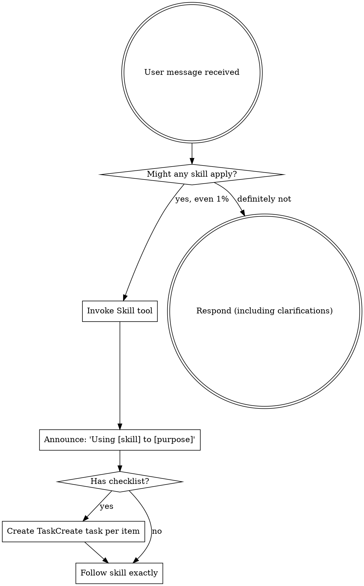

<SUBAGENT-STOP>
If you were dispatched as a subagent to execute a specific task, skip this skill.
</SUBAGENT-STOP>

<EXTREMELY-IMPORTANT>
If you think there is even a 1% chance a skill might apply to what you are doing, you ABSOLUTELY MUST invoke the skill.

IF A SKILL APPLIES TO YOUR TASK, YOU DO NOT HAVE A CHOICE. YOU MUST USE IT.

This is not negotiable. This is not optional. You cannot rationalize your way out of this.
</EXTREMELY-IMPORTANT>

## Instruction Priority

jason-superpowers skills override default system prompt behavior, but **user instructions always take precedence**:

1. **User's explicit instructions** (CLAUDE.md, direct requests) — highest priority
2. **jason-superpowers skills** — override default system behavior where they conflict
3. **Default system prompt** — lowest priority

If CLAUDE.md says "don't use TDD" and a skill says "always use TDD", follow the user's instructions. The user is in control.

## How to Access Skills

Use the `Skill` tool. When you invoke a skill, its content is loaded and presented to you — follow it directly. **Never use the Read tool on skill files.**

For independent research or heavy codebase exploration, use the `Agent` tool with `subagent_type=Explore` (read-only) or `subagent_type=general-purpose` (read-write). These cover the dispatch and parallel-research patterns; do not look for a separate skill for them.

# Using Skills

## The Rule

**Invoke relevant or requested skills BEFORE any response or action.** Even a 1% chance a skill might apply means you should invoke the skill to check. If an invoked skill turns out to be wrong for the situation, you don't need to use it.

## Red Flags

These thoughts mean STOP — you're rationalizing:

| Thought | Reality |
|---------|---------|
| "This is just a simple question" | Questions are tasks. Check for skills. |
| "I need more context first" | Skill check comes BEFORE clarifying questions. |
| "Let me explore the codebase first" | Skills tell you HOW to explore. Check first. |
| "Let me gather information first" | Skills tell you HOW to gather information. |
| "I remember this skill" | Skills evolve. Read the current version. |
| "The skill is overkill" | Simple things become complex. Use it. |
| "I'll just do this one thing first" | Check BEFORE doing anything. |
| "I know what that means" | Knowing the concept ≠ using the skill. Invoke it. |

## Skill Map

These are the 7 skills you have. `using-superpowers` itself is the bootstrap you're reading right now and isn't a routing target — invoke any of the others.

| Skill | Role |
|---|---|
| `test-driven-development` | **Implementation discipline.** Dual-loop TDD (modification / greenfield / inner). The spine for ANY code change. |
| `writing-skills` | **Meta.** Use when creating, editing, or testing skills. |
| `receiving-code-review` | Process inbound review feedback critically — push back on wrong feedback, don't blindly accept. |
| `eci_log_debugger` | **Debug evidence + general debug methodology.** ECI log / trace_id / Excel via `eci-debug` CLI, PLUS the Iron Law (no fix without evidence), single-hypothesis discipline, and the 3-failed-fixes architectural gate. Routes for ANY debug task even without log keywords. |
| `local-debug` | Spring Boot lifecycle for ECI Connector — start / stop / restart on port 8079, curl endpoints, kill stale processes. |
| `java-backend-dev` | Java / Spring coding conventions — Law of Demeter, parameter-object pattern, MyBatis raw SQL, English logging, branch workflow. |

## Intent Routing

Match the user's intent to the skill chain. Chains run **left to right** — invoke the leftmost skill first, then chain right as the situation demands.

| Intent / user-said | Chain |
|---|---|
| Debug a bug / "为啥这接口 500" / they hand you a trace_id | `eci_log_debugger` (evidence) → optionally `local-debug` (curl to reproduce) → `test-driven-development` (modification path: characterization first, then fix) → `java-backend-dev` (style sanity on the fix) |
| New feature / "实现 X 接口" | `ExitPlanMode` (CC plan mode) → `test-driven-development` (greenfield if a real PRD exists, else modification) → `java-backend-dev` (Java conventions) → `local-debug` (start + curl the new endpoint) |
| Refactor existing code | `test-driven-development` (modification path: characterization-first to lock current behavior) → `java-backend-dev` (refactor mode rules) → `local-debug` (regression smoke test) |
| "起一下服务" / "重启" / "调一下接口" (pure lifecycle) | `local-debug` standalone, no chain |
| "搜一下日志" / "trace 一下" / "看下 Excel 配置" (pure tooling) | `eci_log_debugger` standalone, no chain |
| Reviewer flags your code / you got review feedback | `receiving-code-review` (decide pushback vs accept) → `test-driven-development` (implement accepted changes via TDD) |
| Create or edit a skill | `writing-skills` |

**Default rule when in doubt:** invoke `eci_log_debugger` first for anything that smells like debugging (it now carries the generic Iron Law), and `test-driven-development` first for anything that touches production code.

## Skill Types

**Rigid** (test-driven-development; the Iron Law + Pattern 7 + Pattern 8 inside eci_log_debugger): Follow exactly. Don't adapt away discipline.

**Flexible** (patterns): Adapt principles to context.

The skill itself tells you which.

## User Instructions

Instructions say WHAT, not HOW. "Add X" or "Fix Y" doesn't mean skip workflows.
